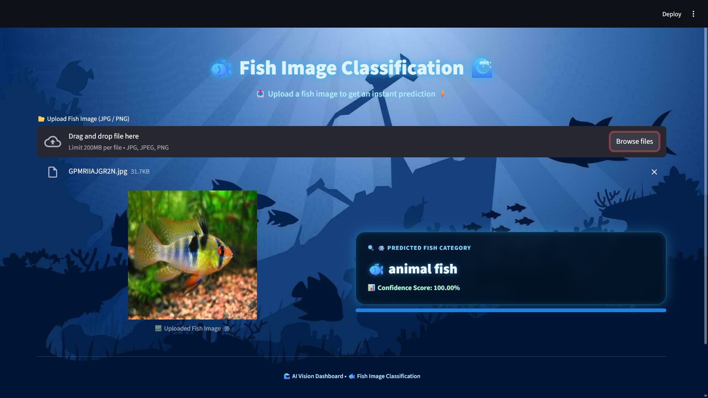

# 🐟 Multiclass Fish Image Classification 

## ❓ Problem Statement

This project implements a **Multiclass Fish Image Classification System** to identify different fish species from images using **Deep Learning**.  
The solution involves training a **Custom CNN from scratch** and applying **Transfer Learning with fine-tuning** on multiple pre-trained models.  
The best-performing model is deployed using a **Streamlit web application** for real-time inference.

---

## 🚀 Project Overview

- Multi-class classification of fish images
- Robust image preprocessing and augmentation
- CNN baseline trained from scratch
- Transfer learning using five pre-trained architectures
- Fine-tuning for performance optimization
- Best model selection based on evaluation metrics
- Interactive Streamlit web application for deployment

---

## 🎯 Skills Takeaway

By completing this project, the following skills were gained:

- Image preprocessing and augmentation
- CNN architecture design
- Transfer learning and fine-tuning
- Multi-class model evaluation
- Model comparison and selection
- Saving and loading trained models
- Streamlit-based deployment
- End-to-end deep learning workflow

---

## 🖼️ Dataset

- Fish images organized into **class-wise folders**
- Split into **train / validation / test** sets
- Loaded using TensorFlow utilities for efficient batching

### 🔗 Dataset Link:

- [Google Drive Folder (Dataset)](https://drive.google.com/drive/folders/1iKdOs4slf3XvNWkeSfsszhPRggfJ2qEd)

---

## 🧹 Data Preprocessing & Augmentation

- Image resizing to **224 × 224**
- Pixel normalization
- Data augmentation:
  - Random rotation
  - Random zoom
  - Horizontal flipping

These techniques improve generalization and reduce overfitting.

---

## 🧠 Model Architectures

### 🔹 Custom CNN (From Scratch)

- Convolution + MaxPooling layers
- Fully connected dense layers
- Softmax output for multi-class prediction

### 🔹 Transfer Learning Models

- **VGG16 ⭐ (Best Model)**
- ResNet50
- MobileNet
- InceptionV3
- EfficientNetB0

All pre-trained models:
- Use **ImageNet weights**
- Start with frozen base layers
- Are further optimized using **fine-tuning**

---

## 📊 Model Evaluation

Models are evaluated using:
- Accuracy
- Precision, Recall, F1-score
- Confusion Matrix
- Training vs validation curves

### 🔹 Performance Summary

| Model | Performance |
|------|------------|
| **VGG16** | ⭐ Best |
| ResNet50 | High |
| MobileNet | High |
| InceptionV3 | High |
| EfficientNetB0 | High |
| Custom CNN | Moderate |

✔ **Final Selected Model:** `VGG16`

---

## 🌐 Streamlit Application

The Streamlit application allows users to:
- Upload fish images (JPG / PNG)
- View predicted fish category
- See model confidence score
- Use a clean underwater-themed UI

### ▶ Run the App
```bash
streamlit run streamlit_app.py
```
### 📊 Streamlit Screenshot


---

## 💾 Trained Models

- Custom CNN
- Transfer learning models:
  - VGG16 ⭐ (Selected Model)
  - ResNet50
  - MobileNet
  - InceptionV3
  - EfficientNetB0

Best model saved as:
```bash
fish_image_classifier_VGG16_v1.keras
```
> Large model files are managed using Git LFS.

---

## 🔁 Reproducibility

- Fixed preprocessing pipeline
- Class index mapping saved for inference
- Same preprocessing applied during training and deployment
- Dependencies listed in requirements.txt

Install dependencies:
```bash
pip install -r requirements.txt
```

---

## 🧪 Environment & Compatibility

### 🔹 Model Training

- Platform: Google Colab
- Python: 3.12.12
- Framework: TensorFlow / Keras
- GPU: Colab GPU

### 🔹 Model Deployment

- Platform: Local Machine (VS Code + Streamlit)
- Python: 3.13.2
- TensorFlow: 2.20+
- OS: Windows
> The trained .keras model format ensures compatibility across environments without retraining.
---
